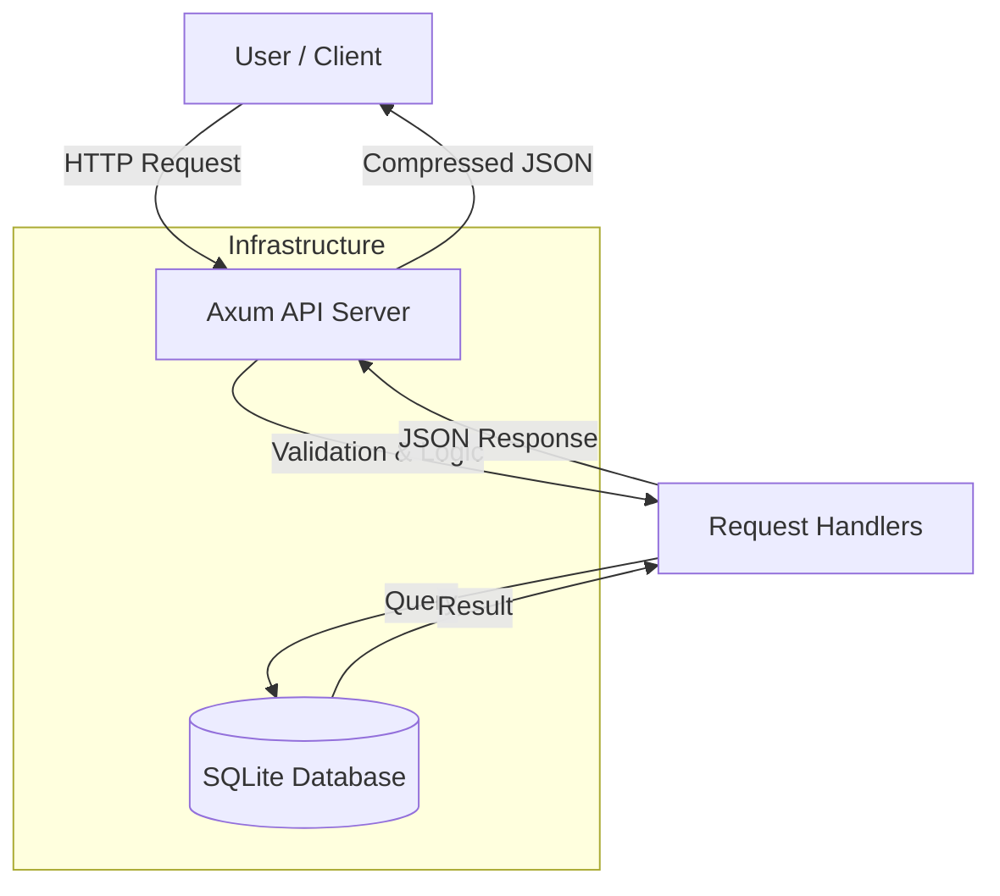

# SeerahBase API

Islamic History (Seerah) and MCQs, built with **Rust** and **Axum**.

## Tech Stack
- **Language**: Rust
- **Framework**: Axum
- **Database**: SQLite (via SQLx)
- **Documentation**: OpenAPI (utoipa)
- **Compression**: Gzip/Brotli (tower-http)

## Setup & Run

### 1. Prerequisites
- Rust & Cargo installed.

### 2. Initialize Database
Creates `seerah.db` and applies schema.
```bash
cargo run --bin init_db
```

### 3. Seed Data
Populates database with content (Eras, Events, MCQs).
```bash
cargo run --bin seed_db
```

### 4. Run Server
Starts the API on `http://localhost:3000`.
```bash
cargo run --bin SeerahBase-api
```

## API Documentation
Interactive Swagger UI is available at:
**[http://localhost:3000/swagger-ui/](http://localhost:3000/swagger-ui/)**

## Endpoints

| Method | Endpoint | Description |
|--------|----------|-------------|
| GET | `/eras` | List all history periods |
| GET | `/eras/{id}/events` | List events in a specific period |
| GET | `/events` | List all events |
| GET | `/questions/event/{id}` | Get MCQs for a specific event |
| GET | `/questions/random` | Get a random quiz (5 questions) |

## Project Structure
- `src/main.rs` - App entry point & router configuration.
- `src/handlers/` - API request handlers.
- `src/models/` - Database structs & OpenAPI schemas.
- `src/db/` - Database connection pool.
- `schema.sql` - Database schema definition.

## Architecture



## API Response Codes

| Status Code | Description |
|-------------|-------------|
| **200 OK** | Request processed successfully. Returns requested data. |
| **404 Not Found** | The requested resource (Era, Event, or Question) does not exist. |
| **500 Internal Server Error** | Unexpected server-side error. |

### Example Responses

**Success (200 OK) - Get Eras:**
```json
[
  {
    "id": 1,
    "name": "মাক্কী জীবন",
    "description": "রাসূল (সাঃ) এর মক্কা জীবন",
    "start_date": "610-01-01",
    "end_date": "622-01-01"
  }
]
```

**Success (200 OK) - Get Random Quiz:**
```json
[
  {
    "id": 1,
    "question_text": "প্রথম ওহী কোথায় নাজিল হয়েছিল?",
    "difficulty_level": "Medium",
    "options": [
      {
        "id": 1,
        "option_text": "হেরা গুহায়",
        "is_correct": true
      },
      {
        "id": 2,
        "option_text": "সাওর গুহায়",
        "is_correct": false
      }
    ]
  }
]
```
